# [ 목차 ]
### 1. [게임명 : Scenario](#프로젝트명)
### 2. [컨셉](#탈출)
### 3. [관련 이미지와 동영상](#3)
### 4. [대표 이미지](#4)
### 5. [컨셉 and 대표이미지 기반 작품묘사](#5)
### 6. [Scenario 구성 요소](#6)

### 7. [게임 시스템 디자인](#7)
　　a. [게임 오브젝트 분해](#7a)

　　b. [파라미터(속성)](#7b)

　　c. [행동](#7c)

　　d. [상태](#7d)

　　e. [플레이어 캐릭터 속성(파라미터)](#7e)

　　f. [게임의 규칙](#7f)

　　g. [게임에서 사용될 공식](#7g) 

### 8. [개발 요구사항 & 흐름도](#8)
　　a. [요구사항(1년/6주)](#8a)

　　b. [키보드 이벤트에 대한 흐름도](#8b)

　　c. [용어정리](#8c)

### 9. [스토리보드](#9)

### 10. [개발작업 일정 (6주)](#10)

### 11. [1주차 작업 결과](#11)

### 12. [2주차 작업 결과](#12)

### 13. [3주차 작업 결과](#13)

# 프로젝트명: Scenario 

# [컨셉] 

## 메인컨셉 : 탈출

- 한 공간 또는 방에서 정해진 미션을 수행하고 다음 스테이지로 넘어가는 진행 형식
- 특정 조건 완료 시 탈출하는 엔딩
- 다양한 유형의 탈출 미션
- 1인칭 시점 이용
- 다양한 컨셉의 방들이 존재

### 서브 컨셉 1 : 퀴즈

- 퀴즈를 풀어서 방을 통과하는 미션이 존재한다.
- 퀴즈에 대한 힌트도 있다.
- 여러가지 장르의 퀴즈       

### 서브 컨셉 2 : 컨트롤

- 마우스와 키보드로 플레이어를 움직여 장애물과 적을 피해서 방을 통과하는 미션이 존재한다.
- 난이도를 상시 조절 할 수 있게 구성

### 서브 컨셉 3 : 선택

- 개인의 상상력 또는 추리에 따른 선택에 따라 답이 달라질 수 있다.
- 풀이 형식과 답이 하나가 아닌 여러가지가 존재할 수 있다.

### 서브 컨셉 4 :멀티 엔딩

- 다양한 엔딩
- 플레이어가 풀어낸 방향에 따라 여러가지 엔딩이 존재한다.
- 해피 엔딩, 배드 엔딩, 세드 엔딩, 열린 엔딩 

### 서브 컨셉 5 : 아이템

- 아이템을 이용하여 다른 방에서 미션을 깰 수 있다.
- 숨겨진 힌트를 발견할 수 있다.
- 미션을 더 쉽게 깰 수 있다

  

# [관련 이미지 & 동영상] 

- 이미지 1 

  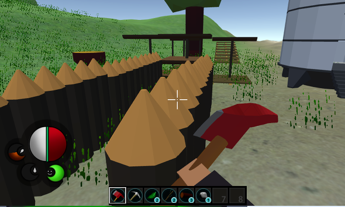
  
  -> 게임 전체적 배경과 그래픽 
  
- 이미지 2

  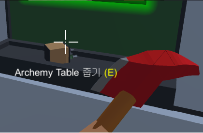
  
  -> 플레이어와 아이템이 상호작용 하는 부분
  
- 이미지 3

  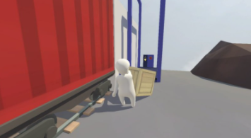
  
  -> '휴먼 폴 플랫'이라는 게임으로 
           한 공간에서 일정 미션을 완료 하면 다음 공간으로 넘어가는 점에서 제가 생각한 게임 흐름과 관련 되어있습니다.
           
- 이미지 4

  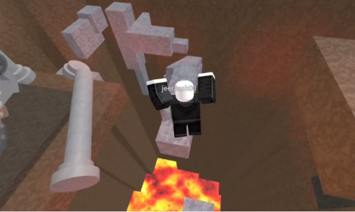
  
  -> 게임 속에서 나오는 점프해서 다음 발판을 밟거나 장애물을 피한다는 점에서 제가 생각한 아이디어와 관련 되어있습니다.
  
  

# [대표 이미지]

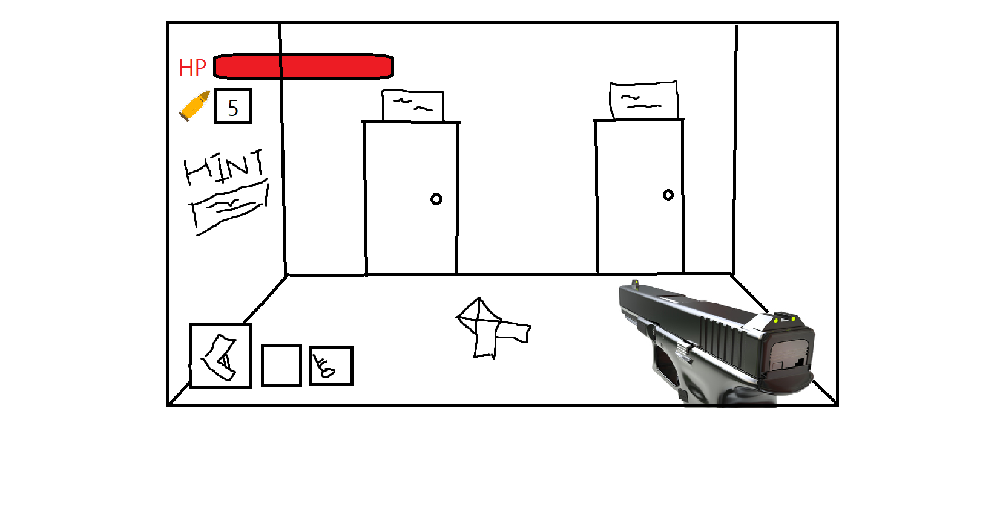

## 서브이미지
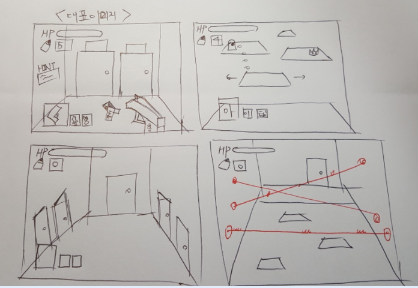

  

# [컨셉 & 대표이미지 기반 작품묘사] 

> ### 대표이미지 기반 작품묘사 : 

- 대표 이미지에서 보듯이 1인칭 시점으로, 체력바, 총알, 소유 아이템을 구성했습니다. 한 공간(방)에서 놓여져 있는 오브젝트들과 힌트를 보고 답을 찾아 다음 공간(방)으로 넘어 갈 수 있도록 게임이 진행됩니다. 여러개의 문이 있을 시 플레이어가 문을 선택할 수 있고 선택한 방향에 따라 엔딩이 달라질 수 있습니다.

- 여러 가지 컨셉의 공간이 존재 합니다.

  - 움직이는 발판, 공격하는 몬스터, 사라졌다 나타났다 반복하는 발판, 레이져 등 장애물을 피해 다음 공간으로 넘어갈 수 있다. 

  - 퀴즈를 풀어 다음 공간으로 넘어갈 수 있다.

  - 한 공간 안에 단서들을 조합해서 답을 찾으면 다음 공간으로 넘어갈 수 있다.(열쇠가 생성, 번호 입력 등등)  

 
- 틴알, 체력포션, 열쇠 등의 아이템이 존재합니다.

- 중간중간 엔딩을 유추할 수도 있고, 엔딩에 대한 궁금증을 자아 낼 수 있는 대사 or 흔적들이 나옵니다.

> ### 컨셉 기반 : 추리와 컨트롤이 필요한 3D 탈출 게임.

  

# [<Scenario> 구성 요소] 
- Scenario(시나리오) : 플레이어가 실험체로 모든 것들이 짜여진 각본에 의해 실험 당한다는 스토리에서 나온 제목 입니다.(플레이어의 해석에 따라 다양하게 유추 할 수 있습니다.)

 

## 1. 메커니즘

[도전 과제]

1. 한 공간에서 다음 공간으로 이동하기 위한 미션들을 수행한다.
2. 오브젝트를 이용해서 답을 찾아야 한다.
3. 장애물을 피하거나 없애서 미션을 수행한다.
4. 3개의 엔딩을 볼 수 있다.

[재미 요소]

1. 다양한 컨셉의 방이 존재해서 다음 방에 대한 궁금증을 유발한다.
2. 아이템을 활용하여 미션을 더 쉽게 깰 수 있다.
3. 한 공간마다 깨는 재미가 있다.
4. 최종 엔딩에 대한 추리도 같이 할 수 있다.

[조작]
 
W : 앞으로 이동
  
A : 왼쪽으로 이동
  
S : 뒤로 이동
  
D : 오른쪽으로 이동
  
Space Bar : 점프
  
E : 오브젝트와 상호작용
  
마우스 왼쪽 클릭 : 공격
  
1 : 일시정지

 

## 2. 이야기

[만들게 된 배경]  
- 지난 학기 때 2D게임에 다양한 기능들을 넣어서 게임을 만들었는데 다음학기에는 3D게임에 여러 요소들을 넣어서 들어보고 싶다는 생각이 있었습니다. 그러는 와중에 ‘휴먼 폴 플랫’이라는 게임을 접하게 되었고, 맵 속에서 다음 공간으로 넘어가기 위해 아이템을 찾아다니고 문제를 풀어나가는 과정들을 보면서, 컨트롤 요소가 들어간 3D탈출게임을 만들면 다양한 기능들이 들어간 재미있는 게임을 만들 수 있을 것 같다고 생각했습니다. 

 [게임 스토리 및 결말]
- 플레이어는 매일 실험을 당하는 실험체로 한 공간에서 하는 미션들은 실험체를 실험하기 위한 것들이다. 정해진 답으로 다음 공간을 넘어가지만 점점 이상한 기억들과 공간 곳곳에 있던 흔적들로 정해진 답이 아닌 다른 곳으로도 이동하기도 한다.
- 세드 OR 배드 엔딩 : “실험체 121번 2000번째 실험 완료” 
 자신이 어떤 존재인지 깨닫고 특별한 거 없이 실험이 끝나는 엔딩.
- 해피 OR 열린 엔딩 : 여러 공간을 지나면서 찾은 흔적들과 이상한 기억들로 다른 차원으로 가는 길을 발견하게 되고 평화로운 숲 속에서 행복하게 살아가는 엔딩
- 히든 OR 트루 엔딩 : 해피엔딩 또한 실험이었다… 
  ->플레이어는 실험에서 벗어날 수 없는 스토리. 해피 엔딩에서 맵 속에 숨겨둔 엔딩.

[카메라 관점]  
-	1인칭 시점으로 모니터 화면이 마치 사람의 눈을 통해 보는 관점이 제공됩니다. 오버워치, 서든어택과 같이 마우스를 통해 시점을 움직일 수 있습니다. 

 

## 3. 미적요소

[디자인][컬러]  
- 한 공간마다 풀어가야 할 미션에 초점이 맞춰져야 하기 때문에 공간마다 미션 컨셉에 맞는 포인트를 넣어 전체적으로 심플하게 구성될 예정입니다. 전체적 느낌은 비슷하지만 방마다 포인트로 다채롭게 연출할 수 있습니다.
- 얻은 아이템, 체력바, 남은 총알 수 등 직관적이지고 게임에 방해되지 않게 한 화면에 구성됩니다.

[음향]  
- 걷는 소리, 점프하는 소리, 배경음악
- 게임 도중 음향에 의해 몰입감을 헤치지 않는, 튀지않고 자연스럽게 구성됩니다.
- 음량 조절도 가능 할 수 있도록 기능이 들어갑니다.
 

## 4. 기술

- Unity3D 엔진을 메인으로 Unity 엔진 속에 있는 기능들을 활용합니다.
- 유니티 애셋스토어 또는 외부에서 가져와 오브젝트로 이용합니다.
- 사운드는 직접 만들지 않고 인터넷에서 제공되는 사운드를 이용합니다.

  
 
# [게임 시스템 디자인] 
 
## a. 게임 오브젝트 분해 
 
|연번|오브젝트 이름|이미지|
|------|---|---|
|1|로봇(플레이어)|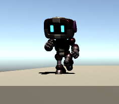|
|2|열쇠(아이템)|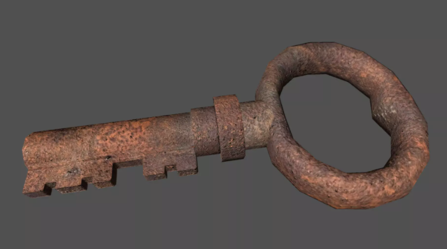|
|3|총,총알(아이템)|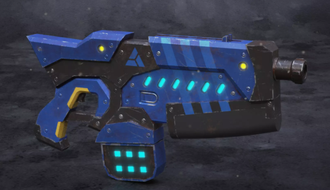  ,  |
|4|포션(아이템)|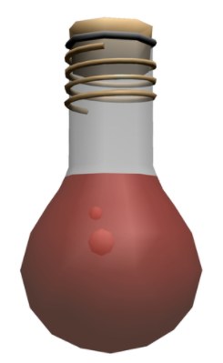|
|5|장애물(총 쏘는 몬스터)|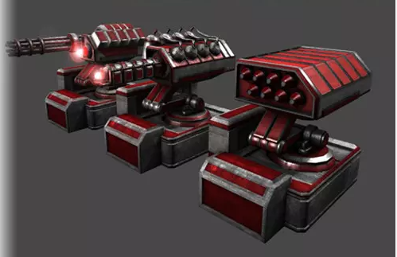|
|6|맵 구성 오브젝트|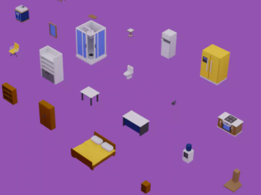|
|7|문(다음 공간으로 갈 수 있는 매개체)|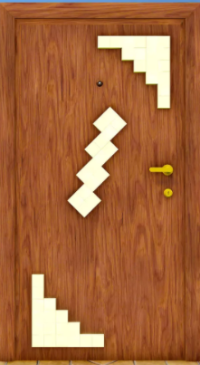|
 
 
## b. 파라미터(속성) 
 
### 1) 오브젝트 이름 : 총(아이템) and 총알
 
|속성|영문명칭|설명|비고|
|---------|-------|---|---|
|데미지|damage|플레이어가 총을 쏘면 몬스터에게 일정 데미지를 줄 수 있다. 또한 플레이어가 몬스터의 총알에 맞으면 일정 데미지를 맞는다. 총알에 데미지 수치가 부여된다.|
|속도|gspeed(gun speed)|총알이 나아가는 속도|
|방향|gdirect|총알이 나아가는 방향|
|크기|gsize|총 및 총알의 크기|
  

### 2) 오브젝트 이름 : 포션(아이템)
 
|속성|영문명칭|설명|비고|
|---------|-------|---|---|
|체력 회복량|HpReco(very)|일정 회복 수치가 지정된다.|
|크기|psize(potion size)|포션의 크기|
  

### 3) 오브젝트 이름 : 맵 구성 오브젝트(문, 쪽지, 열쇠)
 
|속성|영문명칭|설명|비고|
|---------|-------|---|---|
|상호작용|interaction|플레이어와 오브젝트가 'e'키로 상호작용 할 수 있다. 상호작용이 되지 않는 오브젝트가 있다.|
|씬이동|teleport|충돌 시 플레이어를 다른 씬으로 이동시킨다.|

### 4) 오브젝트 이름 : 장애물(총 쏘는 몬스터)
 
|속성|영문명칭|설명|비고|
|---------|-------|---|---|
|현재 체력|mHP|플레이어의 총알에 맞으면 일정 체력이 줄어든다. 0이 되면 파괴되어 사라진다.|
|최대 체력|mMaxHP|장애물의 최대 체력|
|데미지|mdamage(monster damage)|몬스터 공격의 데미지|
|공격속도|mspeed|몬스터의 공격속도|
|방향|mdirect|플레이어를 향해 공격한다.|
|공격범위|mrange|일정 범위안에 플레이어가 들어왔을 때 공격한다.|
  
### 5) 발판 and 레이져
 
|속성|영문명칭|설명|비고|
|----|-------|---|----|
|데미지|odamage(object damage)|특정 발판이나 레이져에 충돌할 시 일정 데미지를 준다.|
|속도|ospeed|일정 속도로 이동한다.|
|범위|orange|일정 범위를 움직인다.|
|크기|osize|크기를 지정한다.|

## c. 행동 

### 1) 오브젝트 이름 : 로봇(플레이어)
  
|행동|설명|
|---|----|
|이동|일정거리를 일정속도로 움직인다.|
|점프|일정높이를 점프하면서 앞으로 나아갈 수 있다.|
|공격|총을 이용해 장애물을 공격하여 없앨 수 있다.|
|상호작용|오브젝트와 상호작용 할 수 있다. 아이템(열쇠)를 이용해서 오브젝트와 상호작용 할 수 있다. |
|습득|무기, 열쇠 등 아이템과 상호작용하면 아이템UI에 표시가 되면서 습득된다.|
|방향전환|마우스로 바라보고 있는 방향을 전환할 수 있다.|

### 2) 오브젝트 이름 : 장애물(총 쏘는 몬스터)
  
|행동|설명|
|---|----|
|공격|일정범위 안에 들어오면 플레이어를 향해 공격한다.|
|정지|플레이어가 범위 안으로 들어오지 않거나 벗어나면 행동이 정지 된다.|
  
### 3) 오브젝트 이름 : 발판, 레이져 
  
|행동|설명|
|---|----|
|생성과 제거|일정시간을 간격으로 생성과 제거가 반복된다.|
|움직임|일정 범위를 움직인다.|
  
### 4) 오브젝트 이름 : 열쇠
  
|행동|설명|
|---|---|
|생성|방안에서 일정 조건을 만족하면 생성|  
|제거|플레이어와 상호작용하면 사라진다.|

### 5) 오브젝트 이름 : 문
  
|행동|설명|
|---|---|
|제거|플레이어가 일정 조건(열쇠를 습득, 번호키에 정답 입력 등)을 달성하면 제거가 되면서 다음 방으로 갈 수 있다.|  
  
  
## d. 상태 

### 1) 오브젝트 이름 : 로봇(플레이어)
 
|현상태|전이상태|전이조건|
|-----|-------|-----|
|정상 상태|피격 상태|외부 공격 또는 낙하로 체력이 줄어든 상태|
|피격 상태|사망 상태|현재 체력이 0이 된 상태|
|사망 상태|정상 상태|리스폰되어 체력이 가득 찬 상태|

  
### 2) 오브젝트 이름 : 장애물(총 쏘는 몬스터)
 
|현상태|전이상태|전이조건|
|-----|-------|-----|
|정상 상태|피격 상태|플레이어의 공격으로 체력이 줄어든 상태|
|피격 상태|사망 상태|몬스터의 현재 체력이 0이 되어 제거된 상태|

## e. 플레이어 캐릭터 속성(파라미터) 
 
|    속성    |영문명칭|설명|비고|
|---------|-------|---|---|
|현재 체력|HP(Hit Point)|플레이어의 체력. 적의 공격에 맞거나 높은 곳에서 떨어지면 일정 체력이 줄어든다. 체력이 0이 되면 플레이어는 리스폰 포인트에서 다시 생성된다. |
|최대 체력|MaxHP|플레이어의 최대 체력|
|점프력|jump|플레이어는 점프의 일정 높이와 거리가 지정된다.|
|이동속도|speed|플레이어는 움직이는 속도가 지정된다.|

  
  
## f. 게임의 규칙 

### 1) 핵심 규칙
 
- 모든 방을 통과하고 마지막 엔딩에 도달한다.

### 2) 보조 규칙
  
- 한 방에서 조건을 달성해야 다음 방으로 갈 수 있다.(문을 열 수 있다.) 
- 체력이 0이 되면 죽고 죽은 방 안에서 다시 시작한다.

## g. 게임에서 사용될 공식 
 
- Unity3D 물리엔진의 물리공식
- 3차원 Vector 공식(회전값, 이동값 등)  
       
  
  
# [개발 요구사항 & 흐름도]  

## a. 요구사항(1년/6주) 
 
### 개발
 1. 시작화면, 게임화면 전체적으로 총 2개의 화면이 있다.
 2. 시작화면에 '플레이'버튼이 있다.
 3. 시작화면에 '조작키'와 '타이틀'이 나타난다.
 4. 게임화면에는 좌측상단에 체력과 총알 갯수, 좌측하단에 갖고 있는 아이템이 나타난다.
   + 4-1 체력 구현
   + 4-2 총알갯수 구현
   + 4-3 아이템 구현(스크롤로 아이템 점환)
     + 4-3-1 열쇠
     + 4-3-2 총(장착,기능)  
     + 4-3-3 포션(회복)
 
 5. 플레이버튼 클릭 시 게임화면으로 이동한다.
    + '1'을 누를 시 게임이 일시정시 되면서 나가기 버튼이 표시된다.
    + 나가기 버튼을 누르면 시작화면으로 돌아간다.
 6. 배경음악 재생
 7. esc를 누를 시 '다시하기'버튼이 있다.
 8. w,a,s,d를 누를 시 앞쪽,왼쪽,뒤쪽,앞쪽으로 일정 속도로 이동한다.
   + 8-1 걸을 때 걷는음악이 재생된다.
 9. spacebar를 누를 시 일정 높이를 점프한다.(2단점프)
   + 9-1 점프할 때 점프음악이 재생된다.
 10. 마우스로 보는 방향을 전환한다.
 11. 마우스 스크롤로 아이템을 선택할 수 있다.  
 
 12. 맵 제작(칸 나누기)
   + 12-1 방마다 컨셉에 맞춰 구성하기
 
 13 특정 오브젝트(쪽지, 문, 번호키, )와 'e'키로 상호작용할 수 있다.
   + 13-1 특정 오브젝트에 다가갈 시 화면 중앙 하단에 'e' 메시지가 뜬다.  
 
 
 14 쪽지와 상호작용하면 글자가 써져있는 창이 뜬다.
   + 14-1 'e'키를 누를 시 다시 창이 사라진다.
 15. 열쇠를 들고 있으면 문과 상호작용할 수 있다.
 16. 번호키와 상호작용하면 마우스로 누를 수있는 '1~9의 숫자'와 '나가기' 버튼이 있다.
   + 16-1 정답 번호를 누를 시 '문을 열수 있다.'라는 메시지가 뜬다. -> 문과 상호작용할 수 있다.
   + 16-2 나가기' 버튼을 왼쪽 클릭 시 창이 닫힌다.  
 
 
 17. 원거리 몬스터의 공격을 받을 시 현재체력이 최대체력의 1/10이 줄어든다.
 18. 레이져와 접촉 할 시 현재체력이 최대체력의 1/3이 줄어든다.
 19. 낭떠러지로 떨어지면 체력이 0이 된다.
 20. 체력이 0이 되면 죽었던 방 안에서 다시 스폰된다.(스폰포인트)
 21. 포션과 접촉 시 현재체력이 최대체력의 1/3만큼 회복된다.  
 
 
 22. 발판 및 레이져 생성
 23. 생성과 제거가 일정시간을 간격으로 반복되는 발판 및 레이져가 있다.
 24. 눈에 보이지만 밟을 수 없는 발판 및 레이져가 존재한다.
 25. 움직이는 발판 및 레이져가 있다.  
   
 
 26. 배드엔딩 구현
 27. 해피엔딩 및 히든엔딩 구현
 
### 그래픽
 1. 플레이어
 2. 열쇠
 3. 쪽지
 4. 총
 5. 총알
 6. 발판
 7. 레이져
 8. 맵 구성 오브젝트
 9. 원거리 공격 몬스터
 10. 포션
 11. 번호키
    
## b. 키보드 이벤트에 대한 흐름도 
   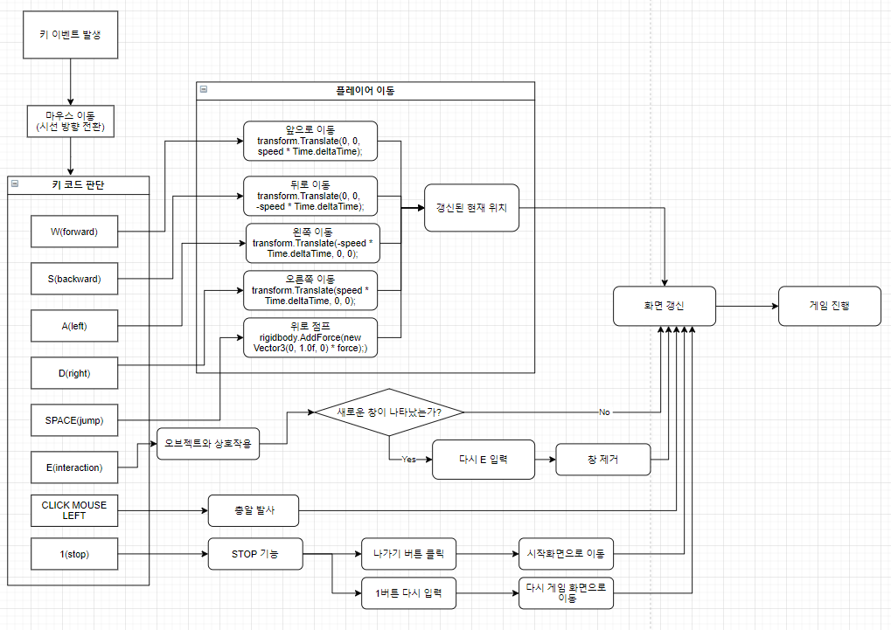
  
## c. 용어정리 
  
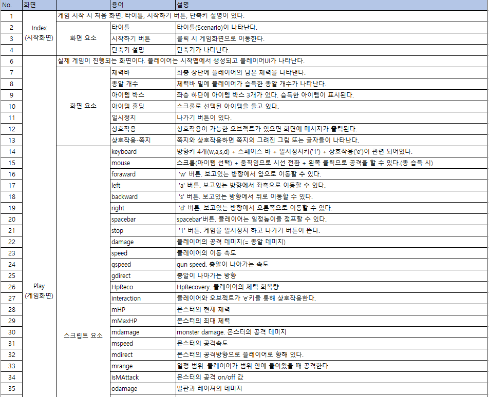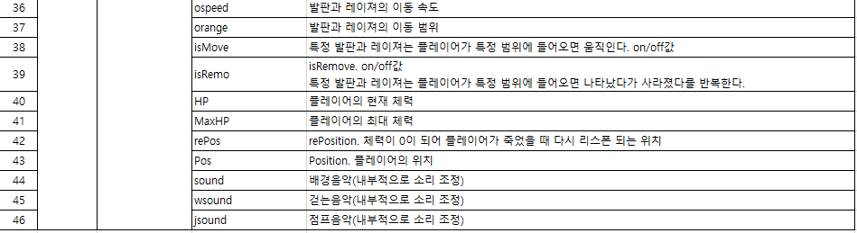 
       
       
       
  
  
# [게임 시나리오 & 스토리보드] 

## 1. 플레이어 관점 흐름(시나리오)
 ● 시작방
- 정면에 하얀 벽에 문이 닫혀있다. 화면 좌측 상단에 체력, 화면 좌측 하단에 아이템용 칸이 3개가 보인다.
- 그 앞에 쪽지가 떨어져있다. 
- 마우스로 쪽지 방향을 잡으며, w키를 눌러서 앞으로 나아간다.
- 50픽셀 근접지점에 가니 중앙하단에 ‘쪽지를 열어보시겠습니다’라는 상호작용 메시지가 뜬다.
- ‘e’키를 눌러서 쪽지를 열어본다.
- 중앙에 쪽지 내용이 보이면서 ‘어딘가에 열쇠가 떨어져 있다.’라는 창이 나타난다.
- ‘e’키를 눌러서 쪽지 창을 닫는다.(움직이거나 마우스를 움직이면 창이 닫힌다. 액션에 의해)
- 마우스를 이용하여 방안을 둘러본다.
- 열쇠를 발견한다.
- 마우스와 w키를 이용하여 열쇠 쪽으로 이동한다.
- 50픽셀 근접지점에 가니 중앙하단에 ‘열쇠를 주우시오.’상호작용 메시지가 뜬다.
- 열쇠를 클릭해서 열쇠를 획득한다
- 열쇠는 방에서 사라지고, 첫 번째 아이템 열쇠가 나타난다.
- 마우스와 이동키를 움직여서 문쪽으로 다가간다.
- 문과 50픽셀 근접지점에서 ‘e키’라는 상호작용 메시지가 뜬다. 
- e키를 눌러 문을 열고 지나간다.
- 가지고 있던 열쇠가 사라졌다.
- 문이 사라지고 지나갈 수 없는 벽으로 바뀌었다.

● 레이져방
- 전방에 움직이는 레이져와 정지 되어있는 레이져들이 보인다.
- 이동키와 점프키를 이용해서 레이져를 피해서 앞으로 나아간다.
- 레이져와 접촉했더니 최대HP의 1/3만큼 현재체력이 줄어들었다.
- 2번 더 접촉했더니 현재 HP가 0이 되면서 레이져방 처음 부분에 다시 스폰 되었다.
- HP는 다시 가득 차 있다.
- 레이져를 피해 문 앞까지 도착했다. 문 앞에 열쇠를 발견한다.
- 시작방에서와 마찬가지로 열쇠를 얻고 문을 열고 통과한다.  

● 점프방
- 전방에 정지해 있는 발판, 움직이는 발판, 공격할거 같은 몬스터(장애물)들이 있다.
- 건너편에는 다음 방으로 갈 수 있는 문이 보인다.
- 이동키와 마우스를 움직여 발판 아래로 떨어졌더니 방 시작 부분에 다시 스폰되었다.
- 이동키와 마우스, 점프키를 이용해 발판을 밟으며 앞으로 나아간다.
- 몬스터에 다가가자 나를 향해 총알을 쏜다.
- 총알에 맞았더니 최대HP의 1/10만큼 현재 체력이 줄어들었다. 
- 총알을 피해 발판을 밟으며 앞으로 나아간다.
- 총알에 많이 맞아 현재 체력이 0이 되었더니 점프방 처음에 다시 스폰되었다.
- 다시 발판을 밟아서 앞으로 나아갔다.
- 날아오는 총알을 피해서 건너편에 있던 문앞에 도착했다.
- 문앞에 열쇠를 발견해서 문을 열어 다음방으로 통과했다.

● 퀴즈방1(물건갯수)
- 방 안에 많은 가구, 물건들이 보인다.
- 건너편에는 문과 번호를 누를 수 있는 버튼들이 보인다.
- 버튼과 50픽셀 근접 시 ‘e키’라는 메시지가 뜬다.
- e키를 눌러본다.
- 마우스로 번호를 누를 수 있게 되어 있고 숫자를 4자리까지 입력 할 수 있는 창이 뜬다.
- 여러번호를 눌러봐도 아무런 반응을 보이지 않는다.
- e키를 눌렀더니 창이 사라진다.
- 방 구석구석을 이동키와 마우스를 이용해 돌아다녀본다.
- 방 구석에 쪽지 하나가 떨어져있다.
- 쪽지와 50픽셀 근접 하니 ‘e키’라는 메시지가 뜬다.
- e키를 누른다.
- 쪽지안에는 많은 글자와 숫자 1이 써져 있다. 
- 글자 속에서 물병이라는 글자를 발견한다.
- e키를 눌러 창을 다시 닫고 방을 돌아다니며 방안에 있는 물병의 개수를 센다.
- 방안을 돌아 다니다가 쪽지를 3개 더 발견하고 그 쪽지 에는 숫자2, 3, 4와 글자 속에서 방 안에 있는 물건을 발견한다.
- 방 안에 있는 물건에 개수를 1234 순서대로 번호키에 입력한다.
- 창을 문이 열렸다는 메시지가 뜬다.
- e키를 눌러 창을 닫고 문을 통과해 지나간다. 

● 퀴즈방2
- 방 중앙에 쪽지가 하나 떨어져 있고 문과 번호키가 보인다.
- 쪽지에 50픽셀 근접 후에 ‘e키’라는 메시지가 뜬다.
- e키를 눌러 상호작용 한다.
- !=2 @=1 #=A $=B %=3 ^=C &=1 *=D   ABCD=????가 써져있는 창이 뜬다.
- 추리를 해 본다.
- e키를 눌러 창을 닫는다.
- 4개의 번호를 여러번 입력해 보지만 아무런 반응이 일어나지 않는다.
- 4213를 입력하니 문이 열렸다는 메시지가 뜬다.
- e를 눌러 창을 닫고 문을 통과한다.

● 퀴즈방3(줄무늬방)
- 줄무늬로 도배가 된 방안 바닥에 쪽지가 하나 떨어져 있다.
- 건너편엔 문과 번호키가 보인다.
- 쪽지를 열어보니 알파벳과 숫자들이 중구난방 쓰여져있다.
- 문제를 풀고 번호 4개를 입력해 지나간다.

● 엔딩방(배드)
- 방안에 많은 로봇들이 줄지어 있다.
- 이동키와 마우스를 이용해 돌아다니다가 중간에 빈곳에 서본다.
- 엔딩 메시지가 뜨면 게임이 종료된다.

● 엔딩방(해피)
- 이전 방 문을 통과하니 나무와 풀 오두막이 있는 평화로운 맵이 보인다.
- 마우스롤 돌려 뒤를 보자 통과한 문은 사라졌다.
- 이동키와 마우스롤 움직여서 맵을 돌아다녀 본다.
- 나무 쪽으로 다가가니 엔딩 메시지가 뜨면서 게임이 종료된다.
+ 히든엔딩 : 통과할 수 있는 보이지 않는 벽을 통과하니 쪽지가 하나 떨어져 있다 -> 그 속에 히든엔딩 메시지가 써져있다. 

## 2. 시나리오 참고자료 
### 1. 시작 맵(문 1개)
  
1) 캐릭터 생성(1인칭)
  - 생성 위치 지정
  - 인터페이스 : 체력, 아이템 칸 3개, 총알 갯수(총을 획득 시 나타남.)
  - w,a,s,d 앞,왼쪽,뒤쪽,오른쪽으로 이동 가능
  - spacebar 점프
  - ‘e’ or ‘마우스 왼쪽 클릭’으로 오브젝트와 상호작용
2) 알 수 없는 쪽지가 떨어져 있다.(쪽지와 클릭 OR e버튼으로 상호 작용) 
  - 상호작용 버튼으로 종이가 나타난다다.
  - ‘어딘가에 열쇠가 떨어져 있다.’가 쓰여져있는 종이가 화면에 나온다.
  - 상호작용 버튼으로 종이가 사라진다.
3) 열쇠 획득(상호 작용)
  - 아이템 칸에 표시 
  - 인터페이스에서 열쇠 선택 시 시점에 표시 -> 문과 상호작용이 가능하게 된다.
4) 문 – 열쇠
  - 문이 열린다.
  - 아이템 칸 + 시점에 나타나있는 열쇠가 ‘열쇠를 사용했다.’라는 메시지와 함께 사라진다.
5) 사운드
  -배경 – 한 음악 반복
  -걸음 – 이동키 누를 때
  -점프 – 점프키 누를 때

### 2. 움직이는 레이져방 (+ 장애물) 방 – 난이도업 다르게 3개
 
1) 죽었을 때 스폰 -> 체력이 0이 되었을 시, 레이져와 접촉 시
2) 레이져 생성 -> 땅바닥에서 움직이는 레이져, 공중에서 움직이는 레이져(스피드 조절-난이도 조절)
               -> 플레이어와 접촉 시 플레이어 일정 체력이 깎인다. 
3) 포션 -> 접촉 시 일정 체력이 회복된다.

### 3. 점프 (+ 장애물) 방 – 난이도업 다르게 3개
 
1) 죽었을 때 스폰 -> 체력이 0이 되었을 때
2) 발판, 움직이는 발판, 일정 시간을 간격으로 사라졌다 나타났다하는 발판
3) 일정 시간을 간격으로, 플레이어를 향해, 공격 하는 원거리 몬스터(장애물)       
4) 포션 -> 접촉 시 일정 체력이 회복 된다.

 5) 점프해서 앞으로가는방, 위로 올라가는 방 존재
 6) 가짜발판 점프맵

### 4. 퀴즈방 – 다른 퀴즈로 5개 + a, 퀴즈 정답 시 열쇠 생성 + 메시지, 오답 시 틀렸다는 메시지만 뜨고 아무런 일도 일어나지 않는다.

 1) 세로 드립 or 대각선 드립 – 이미지(UI) 이용 – 방 안에 있는 물건 개수 - 답은 숫자로 입력
  - 글 속에 스토리 단서도 넣는다.
  - 많은 글자 속에서 물건 이름 여러개를 집어 넣는다.
 
 2) 짧은 퀴즈
   
  - !=2 @=1 #=A $=B %=3 ^=C &=1 *=D    ABCD=???? (답: 4213 -> 글씨 쓰는 횟수,연필을 떼는걸 기준으로) 
  
  -  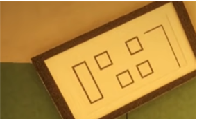 = 0287
 
  - 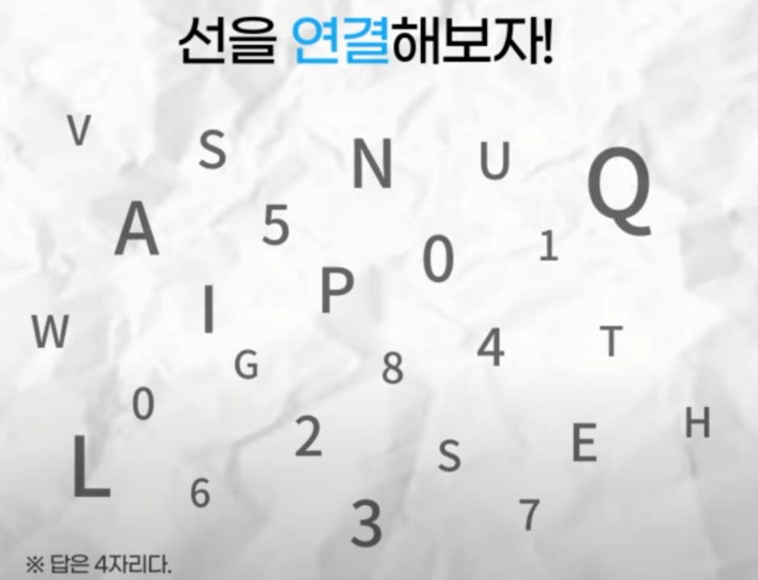
  - ㄴ 온통 선으로된 방:힌트   -> 퀴즈  LINE-> 답: 0504
 
  - 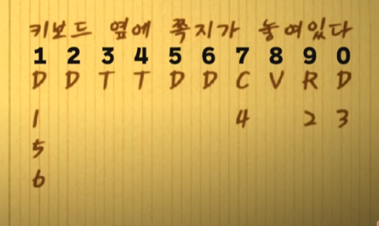
  - ㄴ 일이삼사오육칠팔구영 
  - ㄴ 답:190811 ->변형하기
  - ㄴ 방컨셉 : 자음으로 가득한방
 
3)..
  - 빈방 안에 벽 어딘가에 통과가 가능한 곳이 있다. -> 해피엔딩으로 가기 전에 
  - 평범한 바닥처럼 보이지만 앞에 그려진 길로 가야한다. 도중에 점프도 해야한다. ->점프맵 이용
  - 포션으로 가득찬 방 -> 회복실

### 5. 선택의 방(단순히 문), 단서, 흔적 - 스토리 관련
 
 1) 가장 중요한 것은? 평화, 돈, 시간, 노력, 운   --->  세계 평화를 위해 만들어진 로봇이다 --> 해피엔딩
 
 2) “와본적이 있는것같다.”“익숙한느낌이다” 기타 등등
 
 3) 검은색 배경에 흰색 덧칠 vs 흰색 배경에 검은 색 덧칠 방 , 문2개 ,체크문늬 or 반 나눠서

### 6. 엔딩 방 – 2개(+ 히든)
 
 - 배드엔딩 : 로봇들 진열 , 실험끝 메시지
 - 해피엔딩 : 다른 세계 , 평화로운 분위기의 맵
 - 히든엔딩 : 해피엔딩 맵 속 특정 오브젝트와 상호작용시 -> 다른 공간(실)으로 이동 -> 그곳에 메시지 전달

 
  
 
# [개발작업 일정(6주)] 
  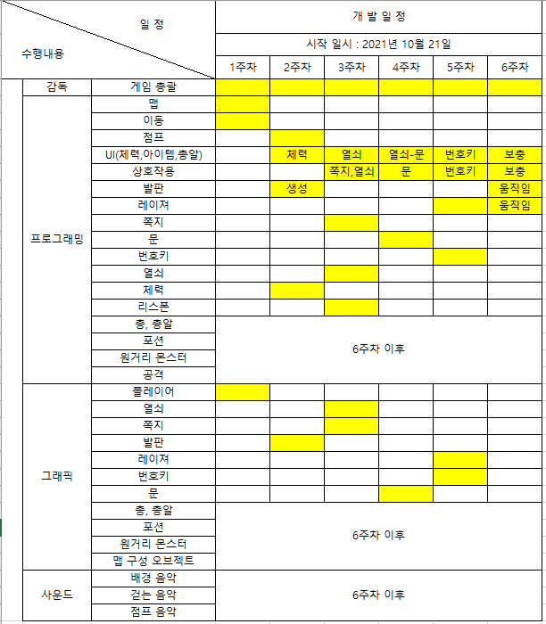
 
  
 
# [1주차 작업 결과] 
작업명 : 전체적인 맵 구성 및 플레이어 이동

## 해당 요구사항

8) w,a,s,d를 누를 시 앞쪽,왼쪽,뒤쪽,오른쪽으로 일정 속도로 이동한다. - [100%]
  
10) 마우스로 보는 방향을 전환한다. - [100%]
  
12) 맵 제작(칸 나누기)  - [100%]

## 작업내용 
  
- 기본적인 플레이어의 이동(w,a,s,d) 구현   - [100%]
- 이동속도 구현  - [100%]
- 마우스로 시선 및 방향 전환 구현 (+감도 설정)  - [100%]
- 맵을 15개의 섹션을 나눠 일자형의 전체적인 맵을 구현합니다.  - [100%]

## 구현영상
  
<figure class="video_container">
  <video controls="true" allowfullscreen="true" poster="black.png">
    <source src="https://user-images.githubusercontent.com/91235024/141099858-06e4a533-43e9-476e-ae2e-5bdb1eed76f2.mp4" type="video/mp4">
  </video>
</figure>
  
- 맵
  
 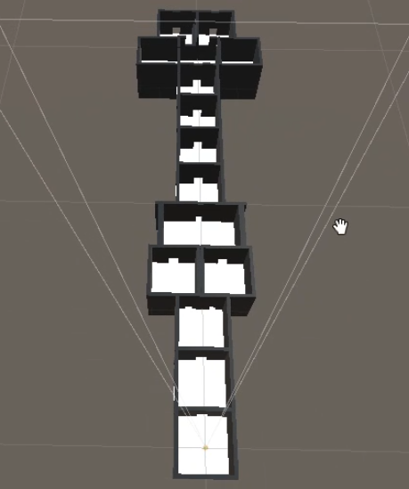
 
# [2주차 작업 결과] 
작업명 : 2주차 점프, 발판, 플레이어 체력 프로그래밍

## 해당 요구사항 
  
9. spacebar를 누를 시 일정 높이를 점프한다. - [100%]
  
22-1. 발판 생성 - [100%] 
  
4-1. 체력 구현 - [100%]
  
## 작업 내용 
  
1) 플레이어 점프 구현 (Script) - [100%]
  
2) 발판 생성 , 임의로 배치 - [100%]
  
3) 플레이어 체력 구현 (Script, UI) - [100%]
  + 임의로 적을 만들어 적과 충돌할 시 체력이 줄어드는지 실험 - [100%]

## 구현영상
- 9 spacebar를 누를 시 일정 높이를 점프한다.
  
  <figure class="video_container">
  <video controls="true" allowfullscreen="true" poster="black.png">
    <source src="https://user-images.githubusercontent.com/91235024/141102905-ce10a94a-07a1-4dd9-8515-7d015fc391da.mp4" type="video/mp4">
  </video>
  
- 22-1 발판 생성
  
  <figure class="video_container">
  <video controls="true" allowfullscreen="true" poster="black.png">
    <source src="https://user-images.githubusercontent.com/91235024/141102758-92d0f441-801f-4ea8-8435-777f8a3a7ba5.mp4" type="video/mp4">
  </video>

  
- 4-1 체력 구현
  
  <figure class="video_container">
  <video controls="true" allowfullscreen="true" poster="black.png">
    <source src="https://user-images.githubusercontent.com/91235024/141102173-fd77ad42-019e-4956-96f8-34fde33bf576.mp4" type="video/mp4">
  </video>

    
# [3주차 작업 결과] 
    
작업명 : 쪽지,열쇠 상호작용 및 리스폰
    
## 해당 요구사항
    
4-3-1 열쇠(Object, GUI) - [100%]
    
11.마우스 스크롤로 아이템을 선택할 수 있다. - [0%]
    
13. 특정 오브젝트(쪽지, 문, 번호키, 열쇠)와 ‘e’키로 상호작용할 수 있다. - [50%]
    
13-1 특정 오브젝트에 다가갈 시 화면 중앙 하단에 ‘e’ 메시지가 뜬다. - [50%]
    
 쪽지와 상호작용하면 글자가 써져있는 창이 뜬다. - [100%]
    
14-1 ‘e’키를 누를 시 다시 창이 사라진다. -> (16 - 2로 대체)
    
16-2 나가기’ 버튼을 왼쪽 클릭 시 창이 닫힌다. - [100%]
    
 19. 낭떠러지로 떨어지면 체력이 0이 된다.  - [100%]
    
 20. 체력이 0이 되면 죽었던 방 안에서 다시 스폰된다.(스폰포인트)  - [50%]
    
    
    
## 작업 내용 : 

열쇠 오브젝트 추가 - [100%]
    
아이템 UI 추가(열쇠 습득 표시) - [100%]
    
마우스 스크롤로 아이템 선택 - [0%]
    
열쇠 오브젝트에 일정거리 다가갈 시 상호작용 메시지 표시 - [100%]
    
열쇠 오브젝트와 상호작용 시 열쇠 오브젝트 제거 + 아이템 UI에 습득 - [100%]
    
쪽지 오브젝트 추가 - [100%]
    
쪽지 오브젝트에 일정거리 다가갈 시 상호작용 메시지 표시 - [100%]
    
쪽지 오브젝트와 상호작용 시 새로운 창 생성 + 나가기 버튼 - [100%]
    
체력이 0이 될 시 방 시작점에서 리스폰 - [50%]
    
낭떠러지로 일정거리 떨어질 시 체력이 0이 된다. - [100%]
    
    
    
## 구현영상
    
1)
- 4-3-1 열쇠(Object, GUI)
- 3 특정 오브젝트(쪽지, 문, 번호키, 열쇠)와 ‘e’키로 상호작용할 수 있다.
- 13 - 1 특정 오브젝트에 다가갈 시 화면 중앙 하단에 ‘e’ 메시지가 뜬다.
    
  <figure class="video_container">
  <video controls="true" allowfullscreen="true" poster="black.png">
    <source src="https://user-images.githubusercontent.com/91235024/141149383-13c8da48-9d06-4f7c-aa29-23c2cee99c85.mp4" type="video/mp4">
  </video>
    
2)
- 13 특정 오브젝트(쪽지, 문, 번호키, 열쇠)와 ‘e’키로 상호작용할 수 있다.
- 13 - 1 특정 오브젝트에 다가갈 시 화면 중앙 하단에 ‘e’ 메시지가 뜬다.
   + 쪽지와 상호작용하면 글자가 써져있는 창이 뜬다.
- 14-1 ‘e’키를 누를 시 다시 창이 사라진다.
- 16-2 나가기’ 버튼을 왼쪽 클릭 시 창이 닫힌다.
    
  <figure class="video_container">
  <video controls="true" allowfullscreen="true" poster="black.png">
    <source src="https://user-images.githubusercontent.com/91235024/141150690-10c80464-d12c-4946-b0d0-b2bc935da65e.mp4" type="video/mp4">
  </video>
    
3)    
 - 19 체력이 0이 될 시 방 시작점에서 리스폰
 - 20 낭떠러지로 일정거리 떨어질 시 체력이 0이 된다.   
    
  <figure class="video_container">
  <video controls="true" allowfullscreen="true" poster="black.png">
    <source src="https://user-images.githubusercontent.com/91235024/141150928-b8c611bb-4afa-47ef-a0fc-79da31ed2322.mp4" type="video/mp4">
  </video>

    
## 추가 및 기타 사항
 
- 11 마우스 스크롤로 아이템을 선택할 수 있다.
    -> 번호 입력으로 아이템 선택 변경 고려.
    
- 19 체력이 0이 될 시 방 시작점에서 리스폰
    -> 방마다 스폰 포인트 지정.
    -> 방 입장 시(문 통과 ) 스폰 포인트 변경.
